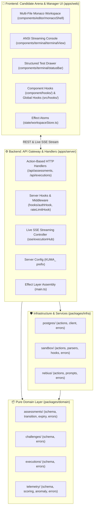

# Kuma (熊) Architecture & System Design

**Kuma** is an autonomous real-world technical assessment platform built for the **Nebius x NVIDIA Global AI Hackathon (Coding & Agentic Engineering Track)**.

---

## 1. High-Level System Architecture



---

## 2. Monorepo Directory & Naming Standards

```
kuma/
├── apps/
│   ├── cli/src/                       # Pure Bun CLI router & subcommands
│   │   ├── commands/
│   │   │   ├── migrate.ts             # 'kuma migrate' runs Postgres migrations
│   │   │   ├── server.ts              # 'kuma server' launches API gateway
│   │   │   ├── web.ts                 # 'kuma web' launches frontend dev server
│   │   │   └── index.ts
│   │   ├── cli.ts                     # Subcommand parser & flag evaluator
│   │   ├── cli.test.ts
│   │   └── main.ts                    # CLI entrypoint
│   │
│   ├── server/src/
│   │   ├── api/
│   │   │   ├── challenges/            # Action-based HTTP route handlers
│   │   │   │   ├── create.ts          # POST /api/v1/challenges
│   │   │   │   ├── fetch.ts           # GET /api/v1/challenges/:id
│   │   │   │   ├── list.ts            # GET /api/v1/challenges
│   │   │   │   ├── delete.ts          # DELETE /api/v1/challenges/:id
│   │   │   │   ├── challenges.test.ts
│   │   │   │   └── index.ts           # Mounts challenges router
│   │   │   ├── respond.ts             # Canonical unified response() helper
│   │   │   └── index.ts
│   │   └── index.ts                   # BunHttpServer & Layer assembly
│   │
│   └── web/src/
│       ├── components/                # Deeply co-located UI primitives
│       │   ├── editor/
│       │   │   ├── monacoShell/
│       │   │   │   ├── hooks/         # Component-specific hooks
│       │   │   │   │   ├── useMonacoEditor.ts
│       │   │   │   │   ├── useEditorShortcuts.ts
│       │   │   │   │   └── index.ts
│       │   │   │   ├── monacoShell.tsx
│       │   │   │   ├── monacoShell.css.ts
│       │   │   │   ├── monacoShell.spec.ts
│       │   │   │   └── index.ts
│       │   │   └── tabBar/
│       │   │       ├── tabBar.tsx
│       │   │       ├── tabBar.css.ts
│       │   │       ├── tabBar.spec.ts
│       │   │       └── index.ts
│       │   ├── terminal/
│       │   │   ├── terminalView/
│       │   │   │   ├── hooks/
│       │   │   │   │   ├── useAnsiAutoScroll.ts
│       │   │   │   │   └── index.ts
│       │   │   │   ├── terminalView.tsx
│       │   │   │   ├── terminalView.css.ts
│       │   │   │   ├── terminalView.spec.ts
│       │   │   │   └── index.ts
│       │   │   └── statusBar/
│       │   │       ├── statusBar.tsx
│       │   │       ├── statusBar.css.ts
│       │   │       ├── statusBar.spec.ts
│       │   │       └── index.ts
│       │   └── layout/
│       │       └── splitPane/
│       │           ├── splitPane.tsx
│       │           ├── splitPane.css.ts
│       │           └── index.ts
│       ├── hooks/                     # Global / cross-cutting application hooks
│       │   ├── useAuth.ts             # Candidate magic-link authentication
│       │   ├── useSSEStream.ts        # Generic SSE streaming consumer
│       │   ├── useKeyboardShortcut.ts # App-wide hotkey listener
│       │   └── index.ts
│       ├── state/
│       │   ├── workspaceStore.ts      # Effect Atoms (@effect-atom/atom)
│       │   └── index.ts
│       ├── mocks/
│       │   ├── fixtures.ts            # MOCK_CHALLENGE_TS & MOCK_CHALLENGE_PY
│       │   └── index.ts
│       └── styles/
│           ├── tokens.ts              # Strict design tokens (colors, space, radii)
│           ├── theme.css.ts
│           └── index.ts
│
├── packages/
│   ├── domain/src/                    # Entity-First pure domain models & contracts
│   │   ├── common/
│   │   │   ├── schema.ts              # LanguageRuntime, FileMap
│   │   │   ├── pagination.ts          # Pagination, PaginationResult, offsets
│   │   │   └── index.ts
│   │   ├── challenges/
│   │   │   ├── schema.ts              # Challenge, ChallengeId
│   │   │   ├── schema.test.ts
│   │   │   └── index.ts
│   │   ├── config.ts                  # ServerConfig, DatabaseConfig via Effect Config
│   │   ├── error.ts                   # Canonical DomainError & ErrorCode
│   │   └── index.ts                   # Root domain barrel export
│   │
│   └── infra/src/                     # Action-Based infrastructure adapters
│       ├── postgres/
│       │   ├── actions/
│       │   │   └── challenges/        # Scoped subpath: @postgres/challenges
│       │   │       ├── create.ts      # Effect SQL INSERT returning Challenge
│       │   │       ├── fetch.ts       # Effect SQL SELECT WHERE id = :id
│       │   │       ├── list.ts        # Effect SQL SELECT paginated
│       │   │       ├── delete.ts      # Effect SQL DELETE WHERE id = :id
│       │   │       ├── challenges.test.ts
│       │   │       └── index.ts
│       │   ├── migrations/
│       │   │   ├── 0001_init.sql      # uuid-ossp, manage_updated_at, case_insensitive
│       │   │   └── 0002_challenges.sql
│       │   ├── migrate.ts             # Bun-native dynamic migration runner
│       │   ├── migrate.test.ts
│       │   ├── client.ts              # Pg layer (PgClient.layerConfig)
│       │   ├── error.ts               # PostgresError & mapPostgresError mapper
│       │   └── index.ts
│       │
│       ├── sandbox/                   # Container runner & test parsers
│       │   ├── actions/
│       │   └── index.ts
│       │
│       └── nebius/                    # LLM challenge synthesis & scoring
│           ├── actions/
│           └── index.ts
│
├── docs/                              # Architecture, standards, and milestone plans
├── Justfile                           # Task runner (dev, test, lint, check, db)
└── biome.json                         # Formatting and linting configuration
```

---

## 3. Package Invariants & Separation of Concerns

1. **`packages/domain` is 100% Pure Business Logic**:
   - Zero external I/O (no DB, no HTTP, no Docker, no Node/DOM globals).
   - Contains entity schemas, branded IDs, state transitions, math/scoring, and domain error types.

2. **`packages/infra` Organizes External Services into Action Files**:
   - Database operations, container execution, and LLM queries are isolated into verb-based action files.
   - Each service folder owns its dedicated `errors.ts`.

3. **`apps/server` Dispatches HTTP Requests to Infra & Domain**:
   - Routes requests to corresponding actions and streams live execution logs over SSE.
   - Server middleware and interceptor hooks live in `apps/server/src/hooks/`.
   - Assembles the dependency graph using Effect Layers.

4. **`apps/web` Is Component-Driven with Effect Atoms**:
   - UI components are co-located with `.tsx`, `.css.ts`, Playwright `.spec.ts`, and component-specific `hooks/`.
   - Global application hooks live in `src/hooks/`.
   - Reactive state is managed via `@effect-atom/atom`.
   - Standalone mock fixtures (`mocks/fixtures.ts`) enable isolated frontend development.
